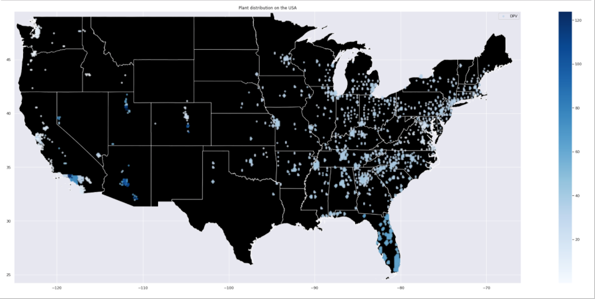
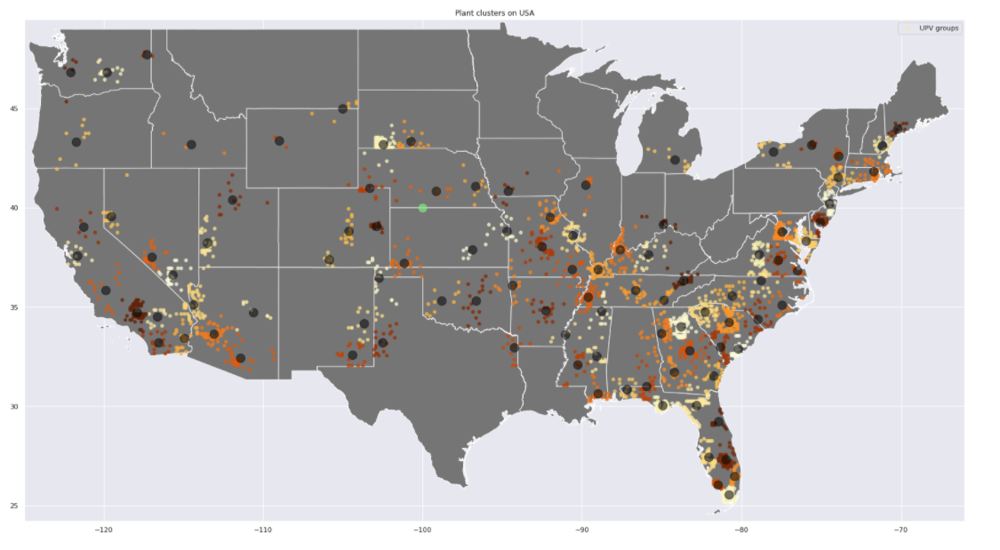
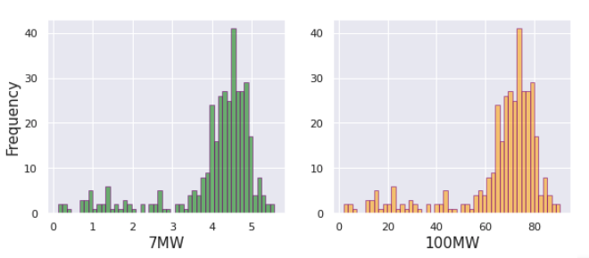

# PowerGenerationProfile_Reescalement
### Custom Solar Power Generation Time Series Data Augmentation 
##### by reescalement of existing data

The data is taken from [Solar Power Data for Integration Studies | Grid Modernization | NREL](https://www.nrel.gov/grid/solar-power-data.html)[1] which are synthetic solar photovoltaic (PV) power plant data points for the United States representing the year 2006. We also use a [US cities database](https://simplemaps.com/data/us-cities)[2].

The pupose of this work is to make data augmentation from this time series power generation profiles dataset in order to generate another simulated time series which has a specified installed peak power  and still has the power generation fluctuations due to climate and seasonal weather.

Brief Description of the notebooks:

##### 0. DataPreparation: 
Here we download and shape all necesary files.

##### 1. PlantVisualization:
Here we get an idea of the overall dataset and the plant distribution int he US territory.

  `geographical_plotting.plants_visualization(geo_df_DPV, map_precision = 'states', BBox = (-125.00, -66.00, 24.20, 49.50), tech = 'DPV')`
  

  `geo_df_UPV_labeled, centers_df_UPV = geographical_analysis.geographical_plant_clustering(geo_df_UPV, N_clusters = 100 )
  geographical_plotting.plant_cluster_plotting(geo_df_UPV_labeled, centers_df_UPV, map_precision = 'states', BBox = (-125.00, -66.00, 24.20, 49.50), tech = 'UPV', coords = (-100,40))` 
  

##### 2. PlantSetVisualization: 
Here we perform an analysis to a plant subset set in order to get the gain insight into how the rescaling is performed and how the different parameters are taken into account. 

##### 3. GetPowerPlant_TimeSerie:
Here we combine and arrange all the necesary calculations in order to achieve the reescalement in a couple of lines of code.

  `UPV_plant_set.scale_signal(degree=3, data='max', MW_out=7, plot_hist=True)` 
  
